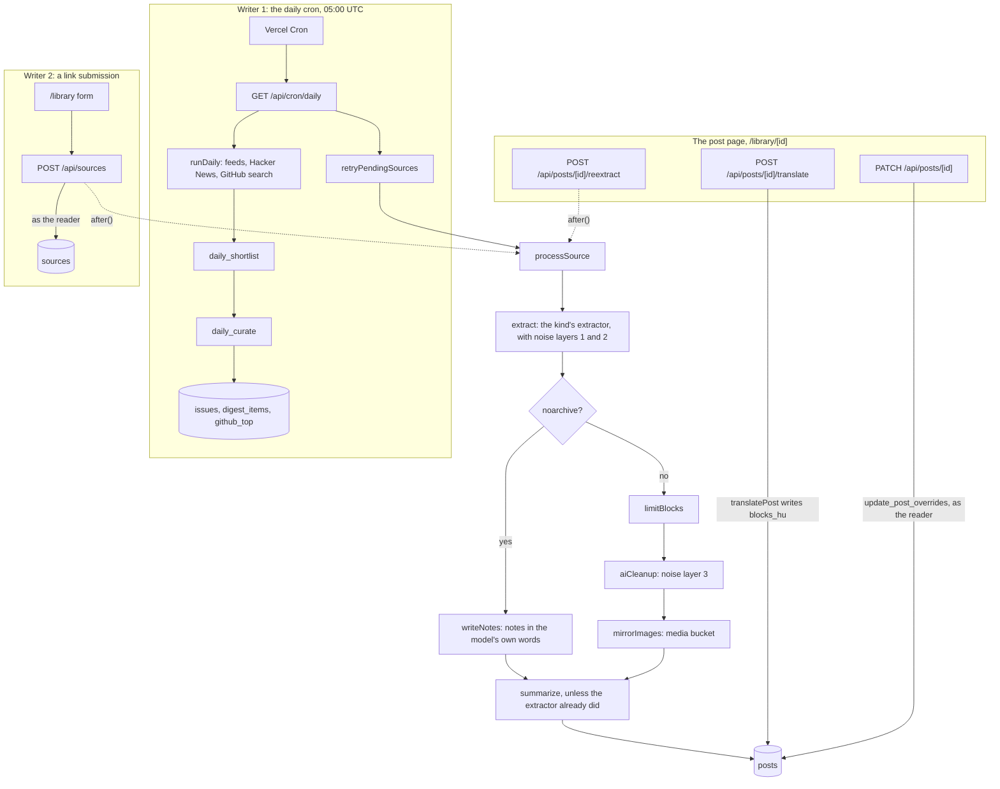

# Danzsu Research Hub

A private, invite-only, bilingual (HU/EN) AI-research hub, published as **NEON NEWS RADAR — Weekly AI Intelligence**. This README is the onboarding guide. The deep reference, with every rule an agent or a reviewer checks, is [CLAUDE.md](CLAUDE.md).

## What it is

**Radar** is the weekly digest. Every morning a cron job collects AI news from RSS feeds, Hacker News and GitHub, lets a model pick and score what matters, and writes it into the current ISO week's issue. Readers see a top-3 must-read, a scored feed in four categories (local models, research, companies, GitHub), a GitHub top-10 and an archive of past weeks. Each reader's read, saved and to-do state is their own.

**Library** is where members save links: articles, YouTube videos, arXiv papers, PDFs, GitHub repositories and X posts. Each link becomes a post. Its content is converted into typed blocks and its images are mirrored, so the post survives the original going dead. A model writes the title, summary and key points in both languages. The submitter can edit the title and summary, hide blocks, and re-extract the post; any reader can ask for a Hungarian translation of the body. The canonical source link is always shown.

| Layer | Choice |
| --- | --- |
| App | Next.js 16 App Router, React 19 |
| Hosting and scheduler | Vercel, with Vercel Cron once a day |
| Database, auth, files | Supabase: Postgres with RLS, magic-link auth, a private Storage bucket |
| Styling | Tailwind 4 (CSS-first) and vendored shadcn/ui on the unified `radix-ui` package |
| Models | Gemini (Google AI Studio) for curation, summaries, video, PDF transcription and translation; Groq for the cheap shortlist and cleanup passes. Plain `fetch`, no SDKs |

## How it works

Two server-side writers put content in. Both do their pipeline work with the Supabase secret key; of their writes, only the submission's `sources` row is inserted as the signed-in reader. (The submitter's edits on the post page also write as the reader, through `update_post_overrides`.) Nothing runs on a personal machine.



**The daily cron** ([`lib/pipeline/daily.ts`](lib/pipeline/daily.ts)) takes the last two days of candidates, drops anything stored in the last 14 days, shortlists them to 40 with a cheap model when there are more, and asks a stronger model for at most 25 items plus a GitHub top-10. Every item gets a permanent id (see [Data contract](CLAUDE.md#data-contract)), and a database function marks the top 3 as must-reads. The same run then retries link submissions that never finished.

**The block pipeline** ([`lib/pipeline/ingest.ts`](lib/pipeline/ingest.ts)) turns a submitted link into a post:

1. **Extractors**, one per source kind in [`lib/pipeline/extract/`](lib/pipeline/extract/). When one fails, the fallback is the generic article extractor (for arXiv and GitHub only), then a metadata-only post with just the page's title and description. That last step fetches the page again, so a submission that gets that far fails when the page can't be reached, whatever its kind. For an article, an X post or a YouTube video, a fetch failure inside the extractor itself (an unreachable page, a video that doesn't exist) fails it straight away, with no fallback.
2. **Noise filtering in three layers.** Layer 1 strips page chrome from the DOM (nav, ads, share widgets, cookie banners), and layer 2 drops leftover blocks (share links, newsletter prompts, duplicates). Both live in [`html-noise.ts`](lib/pipeline/html-noise.ts). Layer 3 asks a cheap model which blocks are not part of the article ([`cleanup.ts`](lib/pipeline/cleanup.ts)), for articles, GitHub READMEs and arXiv papers only.
3. **Image mirroring** ([`images.ts`](lib/pipeline/images.ts)). Up to 30 images are downloaded and re-encoded to AVIF, or animated WebP, at 640 and 1280 px. They go into a private Storage bucket and are served by the `/media` route to signed-in readers only.
4. **Summary or notes.** A model writes the bilingual title, summary, key points and tags. A page that asks not to be archived (`noarchive`) gets no mirrored text at all, only notes in the model's own words.

Every source ends up as the same block model ([`lib/blocks.ts`](lib/blocks.ts)): headings, paragraphs, lists, quotes, code, images, videos, chapters, repo cards and dividers. The page renders only these blocks, never raw HTML. Block ids come from their content, so a hidden block stays hidden after re-extraction as long as its content is unchanged. A re-extraction that fails leaves the post as it was, and the post page shows the error to the submitter until a later run succeeds.

**Translation** ([`lib/translate.ts`](lib/translate.ts)) runs on demand from the post page. Only the text of the blocks goes to the model, in chunks; links, images and structure are copied from the original. A translation that finishes after the post was re-extracted is refused, and the reader is asked to retry.

**Auth, RLS and the one reader write to posts.** Sign-in is a Supabase magic link, and sign-ups are disabled, so the member list is whoever was invited. Every table has row-level security: readers may read content, insert sources, and touch only their own read, saved and to-do rows. The pipeline writes content with the secret key. The one exception is the submitter's edits: the `update_post_overrides` database function checks that the caller submitted the post and then writes only its `overrides` and `hidden_blocks` columns.

**`model_settings`** is a table with one row per model task: a provider and model, plus an optional fallback. Editing a row changes the model on the next run, with no redeploy. API keys stay in environment variables. The task list and the seeded models are in [CLAUDE.md](CLAUDE.md#how-content-gets-in).

## Quick start (local)

> ⚠️ **There is one shared Supabase project, and it is production.** If your `.env.local` points at it, local cron runs, Library submissions and `npm run ingest` all write real rows that every member sees. Two rules while it is shared: **never change its Site URL**, and **never run `supabase db push` against it** (see [Migrations](#migrations)). To experiment freely, use your own Supabase project.

### Prerequisites

- **Node 24 LTS** (recommended). `engines` in `package.json` allows `>=22.13.0`, but the component-test harness is verified only on Node 24; Node 22 is unverified.
- **corepack.** Node 24 bundles it; newer Node releases no longer do, so install the version Node 24.16 ships with: `npm i -g corepack@0.35.0`.
- `curl` for the first cron run, `openssl` to generate `CRON_SECRET`, and optionally the [Vercel CLI](https://vercel.com/docs/cli) for `vercel env pull`.
- A Supabase project: the shared one (ask its owner for an invite and the keys) or your own.
- A Gemini API key from [Google AI Studio](https://aistudio.google.com). Optional: a [Groq](https://console.groq.com) key and a GitHub fine-grained token with no scopes.

### Install

```bash
corepack pnpm@11.25.0 install --frozen-lockfile
```

pnpm is called through corepack directly, because `corepack enable` fails with EPERM under nvm-for-windows. pnpm won't resolve a package version published less than 7 days ago (see [Conventions](#conventions)).

### Environment

Copy [.env.example](.env.example) to `.env.local` and fill it in. Every variable is server-only.

| Variable | Needed | What for |
| --- | --- | --- |
| `SUPABASE_URL` | yes | `https://<project-ref>.supabase.co`; the ref is in the dashboard address, `supabase.com/dashboard/project/<ref>` |
| `SUPABASE_PUBLISHABLE_KEY` | yes | *Project Settings → API Keys*, the publishable key. Acts as the signed-in reader; RLS applies |
| `SUPABASE_SECRET_KEY` | yes | *Project Settings → API Keys*, a secret key. Bypasses RLS: the pipeline, and a few routes after their own checks |
| `GEMINI_API_KEY` | yes | Every Gemini task |
| `GROQ_API_KEY` | no | Without it, the tasks seeded on Groq run on their Gemini fallback |
| `CRON_SECRET` | yes | A long random string (`openssl rand -hex 32`); the cron route's bearer token |
| `GITHUB_TOKEN` | no | Raises the GitHub API rate limit for the daily repo search and the GitHub extractor |

Once the Vercel project exists, `vercel env pull --environment=production .env.local` fills the file from it. A plain `vercel env pull` reads the Development environment, which stays empty unless Development was ticked when the variables were added (see [Deploy](#deploy)). Pulling production puts the production **secret key** on your machine, and that key bypasses RLS on every table and in Storage: keep `.env.local` private, and prefer your own project for experiments. Variables marked **Sensitive** in Vercel come back empty from `env pull`, so enter those by hand.

### Supabase

**On the shared project**, everything is already set up and migrated up to `post_blocks`. Don't change its settings, and don't apply migrations to catch up. Ask the owner to invite you (*Authentication → Users → Invite user*).

To sign in locally against it: request a link on `http://localhost:3000/login`. The email links to the production domain, because the templates build the link from the Site URL. Replace the link's origin with `http://localhost:3000`, keep the path and query, and open it. The token-hash callback ([`app/auth/callback/route.ts`](app/auth/callback/route.ts)) verifies on any origin. A link works only once, so don't open the production one first.

**On your own project**, set it up once:

- *Authentication → Sign In / Providers:* turn off **Allow new users to sign up**. That is the invite list.
- *Authentication → URL Configuration:* set the Site URL to `http://localhost:3000` (it's your project), and add `http://localhost:3000/**` to the Redirect URLs.
- *Authentication → Email Templates:* point Magic Link at `{{ .SiteURL }}/auth/callback?token_hash={{ .TokenHash }}&type=email`, and Invite user at the same link with `type=invite`.
- *Authentication → SMTP Settings:* the built-in mailer delivers only to members of the project's Supabase team and only a few emails an hour, so set up a custom SMTP server before inviting anyone else.
- Apply the migrations in the table below, then check the *Table Editor*: every table has RLS enabled.
- *Authentication → Users → Invite user:* invite yourself.

### Migrations

This table is the one list of migrations; CLAUDE.md and TODO.md point here. Apply them in the Supabase **SQL Editor**, one file at a time, in this order, each only after the previous one succeeded:

| # | File | What it adds |
| --- | --- | --- |
| 1 | `20260923000000_init.sql` | The Radar, Library and reader-state tables, RLS, the `archive_issues` view, `refresh_must_read` |
| 2 | `20260923010000_model_settings.sql` | `model_settings` and its first four tasks |
| 3 | `20260924000000_post_blocks.sql` | The block columns on `posts`, six source kinds, three more tasks, the `media` bucket, `update_post_overrides` |
| 4 | `20260925000000_drop_post_body.sql` | Drops the old `posts.body` column. On a fresh project, run it with the rest. On the shared project, only after the block-based code is deployed |

> ⚠️ **Don't run `supabase db push` against the shared project: it would apply the drop migration early**, while production still reads `posts.body`. This warning stays until the TODO.md item "Csak az M1 deployja után" is done. The Supabase CLI isn't set up in this repository anyway (there is no `supabase/config.toml`).

### Sign in and fill it

`npm run dev`, open `http://localhost:3000/login`, and sign in with the invited address (on the shared project, with the origin swap above).

The first issue, without waiting for 05:00 UTC:

```bash
curl -H "Authorization: Bearer <CRON_SECRET>" http://localhost:3000/api/cron/daily
```

It answers with JSON such as `{ "issue": "2026-W39", "candidates": …, "shortlisted": …, "inserted": …, "repos": …, "retriedSources": … }`, and the Radar fills up.

One link: submit it on `/library`, or from the terminal:

```bash
npm run ingest -- https://example.com/some-article
```

> ⚠️ `npm run ingest` writes a **real** source and post into the project in `.env.local`, visible to every member. It submits as the first user in the project (invite one first), and running the same URL twice fails, because a URL can be submitted only once.

## Deploy

The shared project is already deployed. These steps are for a deployment of your own, backed by your own Supabase project. Don't follow them with the shared project's keys: a second deployment would run a second daily cron, and with it `retryPendingSources`, against production.

1. **Vercel:** *Add New → Project*, import the repository. Next.js and pnpm are detected automatically.
2. **Environment variables:** everything from the [Environment](#environment) table, with your own project's values, for Production and Preview. Tick Development too if you want a plain `vercel env pull` to work; otherwise pull with `--environment=production`. Environment changes take effect on the next deploy.
3. **Cron:** [`vercel.json`](vercel.json) schedules `/api/cron/daily` at `0 5 * * *` (05:00 UTC). With `CRON_SECRET` set, Vercel sends it as the bearer token itself. The cron, submission, translation and re-extraction routes may run for up to 300 s.
4. **Install command:** check that Vercel installs from `pnpm-lock.yaml` in frozen mode with pnpm 11, so the 7-day age gate applies. This is an open item in [TODO.md](TODO.md).
5. **Supabase:** set your project's Site URL to the deployment's domain, add that domain to the Redirect URLs, and send new invites. On the shared project, the Site URL is the production domain and changes only when that domain does (for example after renaming the Vercel project). Only the owner changes it, and never to localhost or a preview URL, because every member's magic link follows it.
6. **First run:** the same `curl` against `https://<domain>/api/cron/daily`. The next morning, check *Vercel → Logs* and *Cron Jobs*.

Schema changes go in before the code that needs them, and a migration may only add while older code is still deployed. A column is dropped only after no deployed code reads it, as `drop_post_body` does.

## Project tour

Every signed-in page shares the app shell (`app/(app)/`): a sidebar on desktop (collapsible to an icon rail), a five-slot bottom bar on phones. Desktop shortcuts: `j`/`k` move between cards, `o` opens (and marks read), `r` read, `l` later, `[` collapses the sidebar, `?` lists them.

| Path | What is there |
| --- | --- |
| [`app/`](app/) | `/login`, the error and 404 pages, the manifest, and the route group below |
| [`app/(app)/`](<app/(app)/>) | The signed-in pages under one app shell: the Radar (`/`), `/archive`, `/archive/[week]`, `/library`, `/library/[id]`, plus their loading page |
| [`app/components/`](app/components/) | The app shell (desktop nav, mobile bottom bar, dialogs, undo toast), the Radar dashboard and its cards, the title band, the language toggle, and `post-blocks`, the block renderer |
| [`app/(app)/library/`](<app/(app)/library/>) | The Library list and submit form, and the post page (`post-article`) with its notices, toolbar (translate, edit link) and editor (edit, hide, re-extract) |
| [`app/api/`](app/api/) | JSON routes: reader state, link submission, post edit, translate, re-extract, and the daily cron |
| [`app/auth/`](app/auth/), [`proxy.ts`](proxy.ts) | Magic-link login, callback and sign-out; the proxy refreshes the session and sends signed-out visitors to `/login` |
| [`app/media/`](app/media/) | Serves mirrored images to signed-in readers |
| [`app/dev/preview/`](app/dev/preview/) | The offline preview on fixtures (development only) |
| [`lib/pipeline/`](lib/pipeline/) | The daily run, the feed list, the ingest pipeline, safe fetching, HTML to blocks, noise filtering, image mirroring, summaries |
| [`lib/pipeline/extract/`](lib/pipeline/extract/) | One extractor per source kind, and the fallback chain |
| [`lib/`](lib/) | The block model, the post view, post edits, translation, the model client, content queries, the language cookie, Supabase clients |
| [`lib/test/`](lib/test/) | The offline render harness for component tests, and a `Post` fixture (`testPost`) |
| [`data/digest-types.ts`](data/digest-types.ts) | The Radar content contract and the tag vocabulary |
| [`components/ui/`](components/ui/) | Vendored shadcn components (never `npx shadcn add`; see [CLAUDE.md](CLAUDE.md#design-language--do-not-erode-it)) |
| [`supabase/migrations/`](supabase/migrations/) | Schema, RLS, database functions, model seeds |
| [`scripts/ingest-url.mts`](scripts/ingest-url.mts) | `npm run ingest` |
| [`.github/`](.github/) | The CI workflow and Dependabot (GitHub Actions only, 7-day cooldown) |
| [`docs/`](docs/) | Specs and plans, and the provenance map of the original archive |

**Where to start reading**, in this order:

1. [`data/digest-types.ts`](data/digest-types.ts) and [`lib/blocks.ts`](lib/blocks.ts): the two content models, Radar items and Library blocks.
2. [`supabase/migrations/`](supabase/migrations/): the tables, what RLS lets a reader do, and the two database functions.
3. [`app/api/cron/daily/route.ts`](app/api/cron/daily/route.ts) → [`lib/pipeline/daily.ts`](lib/pipeline/daily.ts) → [`collect.ts`](lib/pipeline/collect.ts): the Radar writer.
4. [`app/api/sources/route.ts`](app/api/sources/route.ts) → [`lib/pipeline/ingest.ts`](lib/pipeline/ingest.ts) → [`extract/index.ts`](lib/pipeline/extract/index.ts) → [`extract/article.ts`](lib/pipeline/extract/article.ts) → [`html-to-blocks.ts`](lib/pipeline/html-to-blocks.ts): the Library writer.
5. [`lib/llm.ts`](lib/llm.ts): how a task finds its model.
6. [`app/(app)/library/[id]/post-article.tsx`](<app/(app)/library/[id]/post-article.tsx>) → [`lib/post-view.ts`](lib/post-view.ts) → [`app/components/post-blocks.tsx`](app/components/post-blocks.tsx): how a post is read and rendered.
7. [`proxy.ts`](proxy.ts) and [`lib/supabase/server.ts`](lib/supabase/server.ts): sessions and the two Supabase clients.

## Recipes

**Add a news feed.** Add an entry to `feeds` in [`lib/pipeline/feeds.ts`](lib/pipeline/feeds.ts): `{ name, url, hint, limit? }`. `hint` is the category the model starts from; `limit` caps a high-volume feed (25 by default). The parser reads RSS 2.0 and Atom. A dead feed only logs a warning. Hacker News queries and GitHub topics are the two lists below it. If the feed has an unusual shape, add a case to [`collect.test.ts`](lib/pipeline/collect.test.ts).

**Add a source extractor.**

1. Add the kind to `SourceKind` and teach `detectSource` to recognize it, both in [`lib/pipeline/util.ts`](lib/pipeline/util.ts). The order of the checks matters.
2. Write `lib/pipeline/extract/<kind>.ts`, exporting an `Extractor`: `(db, url, note) => Promise<Extracted>`. Build `BlockDraft`s, give them ids with `assignIds`, and fill `text` for the summarizer. Fetch the user's URL with `safeFetch`, and a fixed API host with `apiFetch`.
3. Register it in `extractors` in [`extract/index.ts`](lib/pipeline/extract/index.ts), and decide whether the kind belongs in `RETHROW_FETCH_ERROR` and `NO_ARTICLE_FALLBACK`, and in `AI_CLEANUP_KINDS` in `ingest.ts`.
4. Add a migration that widens `sources_kind_check` and `posts_kind_check`.
5. Add the kind's label and icon on the post page and the Library page; `tsc` reports the missing entry.
6. Test it offline with the fetch and DNS fakes (see [Testing](#testing)).

**Change a model, or add a model task.** To change a model, edit the task's row in `model_settings` in the Supabase Table Editor. Pin an exact version, not a `*-latest` alias. To add a task:

1. Add it to the `Task` union in [`lib/llm.ts`](lib/llm.ts).
2. Add a migration that widens `model_settings_task_check` and inserts the seed row.
3. Call `generate(db, "<task>", zodSchema, prompt)`. A task that sends a YouTube URL or a PDF runs only on Gemini.
4. Add a row to the task table in [CLAUDE.md](CLAUDE.md#how-content-gets-in).

**Add a migration.** Create `supabase/migrations/<YYYYMMDDHHMMSS>_<name>.sql`. Keep it additive while older code is deployed; drop things in a later migration, once no deployed code reads them. Enable RLS on every new table. Apply it in the SQL Editor (never `supabase db push`; see [Migrations](#migrations)). Then add it to the [Migrations](#migrations) table, and update the Database section of [CLAUDE.md](CLAUDE.md).

**Add a UI string.** Put it in the component's own copy object, in both languages, and read it through the reader's language:

```tsx
const copy = {
  hu: { retry: "Újra" },
  en: { retry: "Retry" },
};
// in the component
const t = copy[language];
```

Server pages get `language` from `getLanguage()` ([`lib/language.ts`](lib/language.ts)); client components receive it as a prop. There is no i18n library.

**Run the checks.** All five must pass before a commit:

```bash
npx tsc --noEmit && npm run lint && npm test && npm run build && npm run dup
```

## Testing

`npm test` runs `node --experimental-strip-types --no-warnings --test "lib/**/*.test.ts" "app/**/*.test.ts"`. There is no test framework: tests use `node:test` and `node:assert`, and TypeScript runs through Node's type stripping. Nothing touches the network or Supabase.

**CI:** [`.github/workflows/ci.yml`](.github/workflows/ci.yml) runs the five pre-commit checks (`npx tsc --noEmit`, `npm run lint`, `npm test`, `npm run build`, `npm run dup`) on every push and pull request, with no secrets. Branch protection on `main` is the owner's setting (see [TODO.md](TODO.md)).

- **Helpers:** [`lib/pipeline/fake-db.ts`](lib/pipeline/fake-db.ts) stands in for Supabase and records every write; [`lib/pipeline/mock-fetch.ts`](lib/pipeline/mock-fetch.ts) fakes fetch, DNS, environment variables and model answers, and undoes itself when the test ends. The full list is in [CLAUDE.md](CLAUDE.md#conventions).
- **Components:** [`lib/test/render.ts`](lib/test/render.ts) compiles `.tsx` with the project's TypeScript and renders it to static HTML, with `next/link` and `next/navigation` stubbed. A component test looks like this:

  ```ts
  import { createElement } from "react";
  import { render } from "../../../../lib/test/render.ts"; // first: it registers the .tsx loader
  const { PostToolbar } = await import("./post-toolbar.tsx");

  const doc = render(createElement(PostToolbar, { postId: 7, language: "en" /* … */ }));
  ```

  A static render runs hooks once and no effects, so it cannot see clicks or state changes. It is verified on Node 24; Node 22 is unverified.
- **One test file** runs with the same flags as `npm test`. A path with `[id]` in it is read as a glob character class, so `"app/(app)/library/[id]/post-editor.test.ts"` runs 0 tests and still exits 0. Escape the bracket:

  ```bash
  node --experimental-strip-types --no-warnings --test "app/(app)/library/[[]id]/post-editor.test.ts"
  ```

UI without live data: `npm run dev`, then open `/dev/preview` (development only). It renders every view on fixtures, including empty states and a `&fail=1` offline mode; Playwright checks run against it at 360, 768 and 1280 px.

**What the tests don't cover:** the interactive UI, real RLS policies, live model calls and live websites. Those are checked by hand in a browser (Playwright) against a deployment: sign in, the Radar's read, saved and to-do state, an archived week, one link per source kind, the post page (blocks, images, video and chapters), translation, editing, hiding, re-extraction and its 10-minute cooldown, a `noarchive` page, and no horizontal scroll at 360 and 1280 px.

## Conventions

- **Design language.** Hard corners (`--radius` is 0), system fonts only, hard offset shadows, one fixed theme, and everything fits 360 px with at least 40 px touch targets. The full rules: [CLAUDE.md](CLAUDE.md#design-language--do-not-erode-it).
- **Bilingual.** Every UI string should exist in Hungarian and English, in the component's copy object; the reader's choice is the `lang` cookie. Some labels are still English-only: the post kind labels (`kindLabel`), the Library's FAILED / PROCESSING… and MIRRORED tags, the archive's ITEMS / MIN, the header back links and the dashboard's SYNCED. Model output that readers see (titles, summaries, key points) is written in both languages. Code, comments and prompts are English.
- **No duplication.** Search before writing a helper, and reuse the shared ones listed in [CLAUDE.md](CLAUDE.md#conventions). `npm run dup` (jscpd) fails above 1% duplication.
- **Relative imports in `lib/`,** with the `.ts` extension, so `node --test` can load the files without a bundler. The three exceptions are the Next-only server modules `lib/content.ts`, `lib/language.ts` and `lib/supabase/server.ts`, which use `@/` and are never loaded by tests.
- **Commits** follow Conventional Commits, with lowercase, imperative subjects.
- **Dependencies** are pinned to exact versions, and `pnpm-lock.yaml` is committed. `pnpm-workspace.yaml` refuses any package published less than 7 days ago (`minimumReleaseAge: 10080`); never lower it. The lockfile is marked `-diff` in `.gitattributes`, so review its changes with `git diff --text`. The CI's actions are pinned by commit SHA, and Dependabot proposes their updates no sooner than 7 days after a release.

## Content and copyright

Mirroring other people's articles is a managed risk, not a solved problem. What keeps it defensible:

- **Not indexed.** `robots: noindex` in [`app/layout.tsx`](app/layout.tsx).
- **Invite-only.** Every page except `/login` and every API route needs a signed-in member (the cron needs its secret instead), and so do the mirrored images.
- **`noarchive` is honoured.** A page whose robots meta tag or `X-Robots-Tag` header says `noarchive` is not mirrored. The post holds AI-written notes in the model's own words instead, with a link to the original.
- **Attribution.** Every post shows its canonical source link, the author or site, and a © line.
- **Takedown.** Delete the `sources` row in the Table Editor; its post goes with it. The mirrored images stay, so then delete the `<source_id>` folder in the `media` bucket under *Storage*. There is no takedown button yet (see [TODO.md](TODO.md)).

`noindex` and the auth gate are load-bearing, not cosmetic. This posture does not survive the site becoming public, ad-supported or search-indexed.

## Troubleshooting

**The magic link opens the wrong address.** The email templates build the link from `{{ .SiteURL }}`, so it always points at *Authentication → URL Configuration → Site URL*, whichever site you requested it from. On the shared project that is the production domain, and it must stay that way: to sign in locally, replace the link's origin with `http://localhost:3000` (see [Supabase](#supabase)). On your own project, set the Site URL to where you sign in. Old emails keep the old address. A link that fails to verify (expired or already used) lands on `/login?error=1`.

**No email arrives.** The address may not be invited: the form answers the same either way. Or the mail never left: Supabase's built-in mailer delivers only to members of the project's Supabase team and only a few emails an hour, so a project with other members needs a custom SMTP server (*Authentication → SMTP Settings*).

**The cron answers 401.** The route rejects every request when `CRON_SECRET` is unset in that environment, and any request whose header isn't exactly `Authorization: Bearer <CRON_SECRET>`. On Vercel, redeploy after setting the variable; locally, compare the value in `.env.local` with the one in your `curl`.

**The Gemini quota runs out.** The Vercel logs show lines like `daily_curate: gemini/<model>: generativelanguage.googleapis.com 429: …`. The fallback route runs next; if that fails too, the cron answers `500 daily_failed` and Library submissions fail with the task's error. Wait for the quota to reset, point the task at another model in `model_settings`, or enable billing in Google AI Studio.

**Migrations fail.**

- `model_settings has no row for "<task>" — apply supabase/migrations`: a migration is missing. The last three tasks come from `20260924000000_post_blocks.sql`.
- `violates check constraint "sources_kind_check"`, or `column posts.blocks does not exist`: `20260924000000_post_blocks.sql` hasn't run.
- `relation "…" already exists`: the file already ran. The migrations are not idempotent, and the SQL Editor doesn't record which files ran, so keep track yourself.
- Old pages break after `20260925000000_drop_post_body.sql`: that deployment still read `posts.body`. Deploy the block-based code first.

**The GitHub token expired.** GitHub answers 401 to every request carrying an expired token. The daily run then gets no repositories: the log shows `github topic failed: <topic>: https://api.github.com/… 401` once per topic, the cron answer shows `"repos": 0`, and the GitHub top-10 stops updating. It keeps whatever an earlier run that week wrote, so it goes stale; a new week starts without one. GitHub links in the Library fall back to the article extractor (`github extractor failed for <url>: github 401`). Create a new fine-grained token and update `GITHUB_TOKEN`, or remove the variable: GitHub still answers without it, at a lower rate limit. An expiry warning is planned in [TODO.md](TODO.md).

**Submissions are stuck after three failed attempts.** A source gets 3 attempts, counting the one right after submission; the daily cron retries the rest. During an outage that hits every source (a bad key, a used-up quota), each daily run spends one attempt, so after about three days those sources are no longer retried. There is no button to reset them yet (the TODO item "Hibás beküldések kezelése" in [TODO.md](TODO.md)). Once the cause is fixed, reset them in the SQL Editor, and the next cron run picks them up, 10 at a time:

```sql
update public.sources set attempts = 0 where status <> 'done' and attempts >= 3;
```

## Roadmap

[TODO.md](TODO.md) (in Hungarian) holds the setup checklist, the deferred live checks and the prioritized feature list. Designs and plans live in [`docs/superpowers/`](docs/superpowers/):

- [Unified post template and reading tools](docs/superpowers/specs/2026-09-24-unified-post-template-design.md) (spec) and its [M1 plan](docs/superpowers/plans/2026-09-24-unified-post-template-m1.md)
- [UI/UX, reading signals and search](docs/superpowers/specs/2026-09-24-ux-signals-search-design.md) (spec) and its [milestone A plan](docs/superpowers/plans/2026-09-24-ux-a-app-shell.md)
